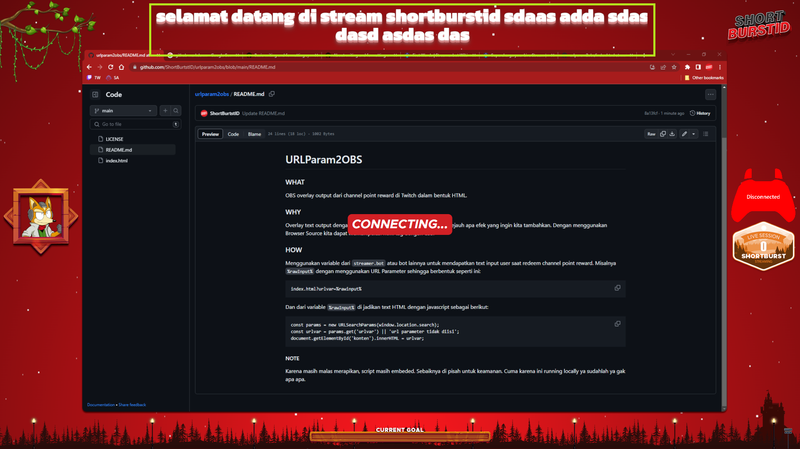

# URLParam2OBS
### WHAT
OBS overlay output dari channel point reward di Twitch dalam bentuk HTML.

### WHY
Overlay text output dengan menggunakan GDIText memiliki batasan sejauh apa efek yang ingin kita tambahkan. Dengan menggunakan Browser Source kita dapat memanipulasi html tag dengan CSS.

Screenshot .png
Text ini menggunakan efek dari CSS, text berasal dari variabel ```%rawInput%```

### HOW
Menggunakan variable dari ```streamer.bot``` atau bot lainnya untuk mendapatkan text input user saat redeem channel point reward. Misalnya ```%rawInput%``` dengan menggunakan URL Parameter sehingga berbentuk seperti ini:

```
index.html?urlvar=%rawinput%
```

Dan dari variable ```%rawInput%``` di jadikan text HTML dengan javascript sebagai berikut:

```
const params = new URLSearchParams(window.location.search);
const urlvar = params.get('urlvar') || 'url parameter tidak diisi';
document.getElementById('konten').innerHTML = urlvar;
```

#### NOTE
Karena masih malas merapikan, script masih embeded. Sebaiknya di pisah untuk keamanan. Cuma karena ini running locally ya sudahlah ya gak apa-apa.
